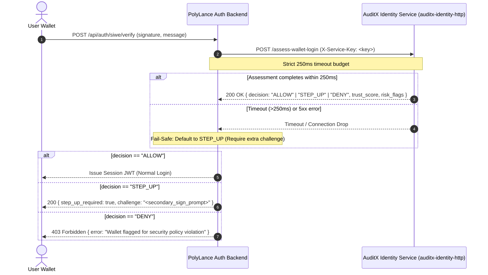

# PolyLance SIWE Wallet Login Risk Assessment Integration Spec

> **Service**: `auditx-identity-http`  
> **Route**: `POST /assess-wallet-login`  
> **Protocol**: HTTP/JSON with `X-Service-Key` Authentication  
> **SLA Budget**: 250ms strict timeout (<300ms p95 SLA)  
> **Security Invariant**: Fail-Safe to `STEP_UP`. NEVER allow silently on timeout, error, or connection drop.

---

## 1. Overview & Architecture

When a freelancer or client signs in via Sign-In with Ethereum (SIWE) on PolyLance, the PolyLance authentication backend calls AuditX's identity risk engine (`auditx-identity-http`).

The engine evaluates:
- Wallet age & on-chain transaction history (via Polygon RPC)
- Domain binding & replay protection
- Known threat feed associations (mixers, drainers, sanctioned addresses)
- Device & network velocity



---

## 2. API Contract

### Request Headers
```http
POST /assess-wallet-login HTTP/1.1
Host: identity.auditx.internal:8088
Content-Type: application/json
X-Service-Key: <IDENTITY_SERVICE_KEY>
```

### Request Body Schema
```json
{
  "wallet_address": "0x1234567890abcdef1234567890abcdef12345678",
  "signature": "0x4f8a12bc90de45f6...",
  "statement": "Sign in to PolyLance",
  "nonce": "d98f7a2c1b",
  "issued_at": "2026-09-21T00:00:00.000Z",
  "ip_address": "198.51.100.42",
  "user_agent": "Mozilla/5.0 ...",
  "device_fingerprint": "fp_8a7d6e5c"
}
```

### Response Schema (200 OK)
```json
{
  "wallet_address": "0x1234567890abcdef1234567890abcdef12345678",
  "trust_score": 85,
  "decision": "ALLOW",
  "risk_flags": [],
  "latency_ms": 14.2,
  "requires_extra_challenge": false
}
```

### Decision Matrix:
- `ALLOW`: Trust score $\ge 70$, no critical flags. Issue standard session token.
- `STEP_UP`: Trust score $< 70$, or timeout/service error. Require second signed challenge (e.g. 2FA or re-sign dedicated nonce).
- `DENY`: Wallet associated with OFAC sanctions, active drainers, or blacklisted exploiters. Block login.

---

## 3. Node.js / TypeScript Integration (`WalletRiskClient`)

```ts
import { WalletRiskClient } from './identity/walletRiskClient.js';

const riskClient = new WalletRiskClient(
  process.env.IDENTITY_SERVICE_URL || 'http://127.0.0.1:8088/assess-wallet-login',
  process.env.IDENTITY_SERVICE_KEY,
  250 // 250ms timeout
);

const assessment = await riskClient.assessLogin({
  wallet_address: req.body.address,
  message: req.body.message,
  signature: req.body.signature,
  ip_address: req.ip,
  user_agent: req.headers['user-agent'] || '',
  device_fingerprint: req.body.fingerprint || '',
});

if (assessment.decision === 'DENY') {
  return res.status(403).json({ error: 'Access denied: high risk wallet' });
}

if (assessment.requires_extra_challenge) {
  return res.status(200).json({ requiresStepUp: true, reason: assessment.risk_flags });
}

// Proceed with standard login...
```
